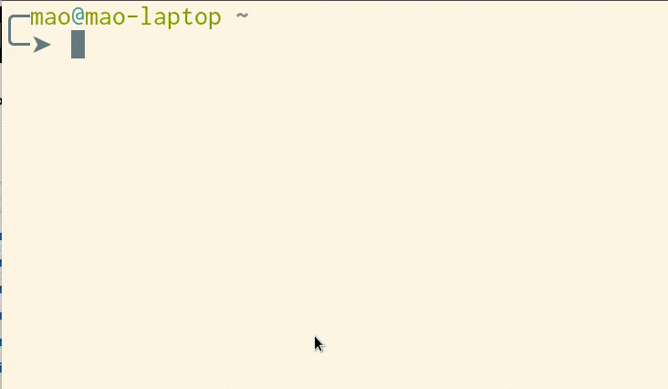

go-ecbpass
==========

**go-ecbpass** is a tool to generate pseudorandom password that can safely be used on various websites. The generated password is deterministic and is based on the user's master password and the domain of the URL provided.

Features
-------

* Accepts URL, domain is extracted automatically.
* Automatic 'copy to clipboard' via `xclip`. (Linux only)
* Entirely stateless. No backup needed.
* You immediately realize it if you mistype the master password.

Install
-------

### AUR package

`go-ecbpass`: https://aur.archlinux.org/packages/go-ecbpass/

### Build from source

    go get && go install

Documentation
-------------

man page: `man go-ecbpass` or [view from source](./doc/go-ecbpass.1.txt)

### How it works

    sitekey := scrypt.Key(password, domain, 262144 /* 2^18 */, 8, 3, 12)
    sitepassword := encode(sitekey)

where `encode` is some simple encoding function that turn `[]byte` to ASCII string.